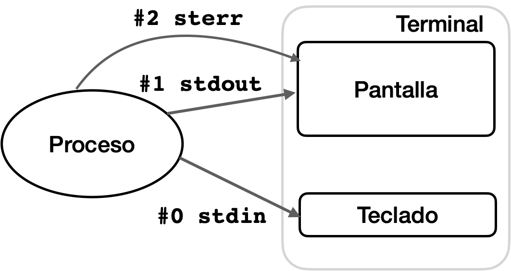

**Laboratorio de Sistemas**

**Operativos y Redes **

**<sub>Guía Teórico/Práctica - UNIX y GNU/Linux</sub>**

**<sub>Rev 1.0 - 06/04/2025</sub>**


# 1 Introducción

El presente documento contiene referencias teóricas sobre los temas a trabajar en la clase. 

Al final de cada sección se incluye una serie de ejercicios **para realizar extraclase **y luego debatir las soluciones en clase.

Se recomienda leer el documento completo y consultar antes de la clase todas las dudas o inquietudes que tengan sobre el contenido.

Inquietudes y consultas personales sobre los temas a tratar serán también bienvenidas.


# 2 GNU/Linux 

En las clases anteriores vimos que GNU/Linux es una familia de sistemas operativos de tipo Unix que utilizan el kernel Linux. 

GNU/Linux puede instalarse en prácticamente cualquier computadora personal, servidores y también en dispositivos móviles y embebidos. 

GNU/Linux, como cualquier otro sistema operativo, se compone de un gran número de paquetes de software, que son desarrollados de forma independiente por miles de programadores y proyectos. 

Normalmente estos paquetes son integrados por un distribuidor y entregados como una **distribución GNU/Linux**. 

Las distribuciones GNU/Linux incluyen todo el software necesario para instalar un servidor o un escritorio. Algunas de las aplicaciones comúnmente incluidas incluyen: el navegador web Firefox y las aplicaciones de oficina LibreOffice.

Los ejemplos y ejercicios de este documento están basados en la distribución **Ubuntu**,  no obstante aplican prácticamente a todas las distribuciones (e incluso a otros sistemas UNIX).


# 3 Conceptos Básicos


## 3.1 Usuarios

Los sistemas Unix son multiusuario, es decir soportan que varios usuarios los utilicen simultáneamente. 

Todos los usuarios, excepto uno, tienen unos privilegios bastante restringidos y no pueden modificar el sistema. De este modo unos usuarios se ven protegidos de las acciones de los otros. 

Existe un usuario especial llamado** root **(también conocido como superusuario o superuser) con privilegios de administración absolutos sobre el sistema. 

Para realizar las tareas cotidianas nunca hay que acceder al sistema como **root**. En algunas distribuciones este usuario está deshabilitado por defecto y sólo se pueden adquirir los privilegios de administrador temporalmente. 


## 3.2 Terminal	

El **shell **(o terminal) es un intérprete de comandos. La terminal nos permite ejecutar software escribiendo el nombre del programa que queremos ejecutar en la terminal. Por ejemplo, para pedir una lista de los archivos presentes en el directorio actual: 


```
$ ls 
```


Hay varios tipos (versiones del programa) de **shell**, cada uno con características propias. Los más comunes son **Bourne Shell** (sh), **Cshell** (csh), **Korn Shell** (ksh) y **Bourne-Again Shell** (bash).

**sh **(Bourne) es una versión original de UNIX, mientras que** bash** (Bourne-Again) es una versión de sh de código abierto y con el agregado de funcionalidades.


## 3.3 Prompt ($) 

El **prompt** ($) es un mensaje, que junto con el cursor parpadeante, indica que el **shell** está esperando un comando. 

Los prompts por defecto son $ (usuario sin privilegios), # (usuario **root**).

El prompt es configurable, por ejemplo en Debian (bash) tiene el siguiente formato por defecto:


```
usuario@hostname:~$ Prompt de un usuario sin privilegios (usuario común) 
root@hostname:~#    Prompt del  superusuario (root) 
```


En ambos ejemplos el prompt indica el usuario actualmente en la sesión de **shell**, el nombre del sistema (hostname) y el directorio donde se encuentra posicionada la sesión en ese momento (~).  

~ es la abreviatura del home directory del usuario (por ejemplo /home/usuario).

Si cambiaramos de directorio, el prompt se veria asi:


```
ubuntu@server10:~$ cd /etc/init.d
ubuntu@server10:/etc/init.d$
```


En el ejemplo anterior, la sesión de **shell** pertenece al usuario` ubuntu` en el sistema `server10` y se encuentra posicionado en `/etc/init.d`

El mensaje del prompt es configurable en una “variable de entorno” (son variables para almacenar algunos valores que pueden ser utilizados por el **shell**) . 

Por ejemplo en Ubuntu, en la variable PS1.


```
ubuntu@server10:~$ echo $PS1     Muestra el contenido de PS1                   
\[\e]0;\u@\h: \w\a\]
${debian_chroot:+($debian_chroot)}\[\033[01;32m\]\u@\h\[\033[00m\]:\[\033[01;34m\]\w\[\033[00m\]\$       
```


El formato del prompt está dado por: `\u@\h:\w\$`

`\u `se reemplaza por el nombre de usuario

`\h `se reemplaza por el hostname

`\w `se reemplaza por el directorio de trabajo (working directory)

Nota: el significado de `{debian_chroot:+($debian_chroot)}` lo veremos más adelante, pueden ignorarlo o incluso quitarlo de la variable. Las otras secuencias son opcionales y se usan para definir los colores:

Color del usuario y hostname (verde brillante):


```


### \[\033[01;32m\]\u@\h\[\033[00m\]

```


* `\033[01;32m` → verde brillante \

* `\u@\h` → usuario y hostname \

* `\033[00m` → resetea el color \


Color del directorio actual (azul brillante)


```


### \[\033[01;34m\]\w\[\033[00m\]

```


* `\033[01;34m` → azul brillante \

* `\w` → directorio actual \

* `\033[00m` → resetea el color \


El prompt se puede cambiar editando la variable PS1, por ejemplo:


```
ubuntu@server10:~$ export PS1="[\u en el directorio \w]$"
[ubuntu en el directorio ~]$
```


Nota: manejo de variables de entorno lo vamos a ver más adelante.

Cuando el prompt está en pantalla, se puede ejecutar cualquier comando, por ejemplo:

`$ls  ` lista el contenido del directorio actual

`$ls /etc/rc2.d/ `  lista el contenido del directorio /etc/rc2.d/ 

Normalmente el comportamiento de los programas puede ser modificado pasándole parámetros. Por ejemplo, podríamos pedirle al programa ls que nos imprima una lista de archivos más detallada escribiendo: 


```
$ ls -l   
```


## 3.4 Ayuda y Referencias

Cada comando tiene unos parámetros y opciones distintos. La forma estándar de obtener información sobre estos parámetros suele ser utilizando las opciones ‘–help’, ‘-h’ o ‘-help’, aunque esto puede variar en comandos no estándar. 


```
$ ls --help 
```


Otro modo de acceder a una documentación más detallada es acceder al manual del programa utilizando el comando man (MANual): 

`$ man ls` (para terminar pulsar "q") 

`man` es un programa interactivo, cuando ejecutamos el comando el programa se abre y el prompt desaparece. **man** es en realidad un visor de archivos de texto por lo que cuando lo ejecutamos la pantalla se rellena con la ayuda del programa que hemos solicitado. Podemos ir hacia abajo o hacia arriba y podemos buscar en el contenido. El prompt y la posibilidad de ejecutar otro programa no volverán a aparecer hasta que no cerremos el programa interactivo. En el caso de man para cerrar el programa hay que pulsar la tecla “q”. 


## 3.5 Completado automático e historia 

El intérprete de comandos dispone de algunas utilidades para facilitarnos su uso. Una de las más utilizadas es el completado automático. Podemos evitarnos escribir una gran parte de los comandos haciendo uso de la tecla tabulador. Si empezamos a escribir un comando y pulsamos la tecla tabulador el sistema completará el comando por nosotros. Para probarlo posicionarse en el directorio home y crear los archivos datos_1.txt, datos_2.txt y experimento.txt: 


```
$ cd 	(cd "change directory", sin parámetros posiciona en homedir)
~$ touch datos_1.txt (touch crea un archivo de texto vacío)
~$ touch datos_2.txt 
~$ touch experimento.txt 
```


Si ahora empezamos a escribir `cp e` y pulsamos el tabulador, el intérprete de comandos completará el comando automáticamente: 


```
~$ cp e  <tab>
~$ cp experimento.txt 
```


Si el intérprete encuentra varias alternativas completará el comando hasta el punto en el que no haya ambigüedad. Si deseamos que imprima una lista de todas las alternativas disponibles para continuar con el comando deberemos pulsar el tabulador dos veces. 


```
~$ cp d <tab>
~$ cp datos_   <tab><tab>
 datos_1.txt datos_2.txt 
~$ cp datos2  <tab>
~$ cp datos2.txt
```


También se puede usar esta funcionalidad para buscar comandos sabiendo las primeras letras del nombre. 

Otra de las funcionalidades que más nos pueden ayudar es la historia. El intérprete recuerda todos los comandos que hemos introducido anteriormente. Si queremos podemos obtener una lista de todo lo que hemos ejecutado utilizando el comando `history`. 


```
$ history
460  ls -l
461  echo "chau" > chau.txt
462  cp chau.txt hola2.txt
```


La salida de este comando lista los comandos que se ejecutaron por el usuario actual, tanto en la sesión actual como en sesiones pasadas.

Los comandos pueden volver a ejecutarse con` !&lt;número de orden>`


```
$ !460
ls -l
total 1145744
-rw-r--r--    1 daniel staff      18301 Dec 26  2017 Android Test.txt
drwxr-xr-x    5 danie  staff        160 Oct 27  2017 AndroidStudio
```


También se pueden utilizar los cursores  &lt;arriba>/&lt;abajo> para revisar los comandos anteriores. Esa acción vuelve a colocar el comando en la línea del prompt de modo que se ejecutarán al presionar &lt;enter>


## 3.6 Ejercicios

Utilizando un usuario sin privilegios.


1. Lista todos los comandos que empiezan por apt 
2. Modifica el prompt de modo de que solo aparezca el signo $, luego volver a la configuración anterior.
3. Utilizando el programa man, indicar que realiza el siguiente comando:	


```
$ cp -if  /dir1/archivo1 /dir2/

```


4. Utilizando el programa man o las opciones de ayuda, averigue que hacen los comandos` cat y`  `more` y pruebelos con archivos del directorio /etc. Que contiene el archivo` /etc/passwd` ?
5. Buscar comandos ejecutados anteriormente y volverlos a ejecutar. Tanto utilizando el comando history como las teclas &lt;arriba>/&lt;abajo>
6. Idem 5, pero modificando alguno de los parámetros del comando anterior.


# 4 El sistema de archivos 


## 4.1 Organización de Archivos UNIX (GNU/Linux)

El sistema de archivos controla cómo se almacenan los archivos. Sus dos tareas principales son guardar y leer archivos previamente guardados. 

Los sistemas de archivos tienen directorios en los que organizar los archivos y estos directorios están organizados jerárquicamente. La jerarquía implica que un directorio puede contener subdirectorios. El directorio más alto en la jerarquía del que cuelgan todos los demás se denomina raíz (**root**). En los sistemas Unix el directorio raíz se representa con una barra “/” y sólo existe una jerarquía, es decir, sólo existe un directorio raíz, incluso aunque haya distintos discos duros en el ordenador. 

Dentro del directorio raíz podemos encontrar subdirectorios, por ejemplo en Linux existe el directorio home. home es por tanto un subdirectorio del directorio raíz. Esta relación se representa como: 


```
/home 
```


home es el directorio dónde se encuentran los directorios de los usuarios en un sistema Linux. Imaginemos que tiene los subdirectorios daniel y maria. Se representaría como: 


```
/home/daniel 
/home/maria 
```


En el directorio raíz (/) hay diversos directorios que, en la mayoría de los casos, sólo interesan al administrador. Los usuarios normalmente sólo escriben dentro de un directorio de su propiedad localizado dentro de** /home** y denominado como su nombre de usuario. 

Los usuarios también pueden escribir en** /tmp** aunque normalmente son los procesos lanzados por estos lo que hacen esta escritura. Es importante revisar el espacio libre en la partición en la que se encuentra /tmp para que no se colapse el sistema. Recordar que /tmp es borrado habitualmente por el sistema. Normalmente con cada nuevo arranque. 


## 4.2 Rutas absolutas, relativas y directorio de trabajo 

Para referirnos a un archivo o a un directorio debemos indicar su ruta (path. Un ejemplo de ruta podría ser`: /home/daniel/documentos/tesis.md` 

Este tipo de rutas en las que se especifican todos los subdirectorios empezando desde el directorio raíz se denominan rutas absolutas. 

Para no tener que escribir la ruta absoluta completa cada vez que queremos referirnos a un archivo o a un directorio se crearon los conceptos de directorio de trabajo y de ruta relativa. 

El directorio de trabajo es una propiedad del terminal (del **shell**) en la que estamos trabajando. Siempre que estemos trabajando en una terminal tendremos asignado un directorio de trabajo. Por ejemplo, si nuestro usuario es daniel sería normal que al abrir un terminal nuestro directorio de trabajo fuese: 


```
/home/daniel 
```


El directorio de trabajo se utiliza para escribir rutas a archivos relativas al mismo. De este modo nos ahorramos escribir bastante. Imaginemos que daniel tiene en su directorio un documento llamado` peliculas.txt`. La ruta absoluta sería. 


```
/home/daniel/peliculas.txt 
```


Mientras su directorio de trabajo sea /home/daniel la ruta relativa sería: 

`peliculas.txt` 

Es decir, podemos escribir rutas relativas al directorio de trabajo, rutas que en vez de partir del directorio raíz parten desde el directorio de trabajo. Las rutas relativas se diferencian de las absolutas en los sistemas Unix porque las absolutas empiezan por “**/**” y las relativas no. 

Es común referirse al directorio de trabajo de una terminal como a un lugar en el que nos encontramos mientras estamos trabajando en la terminal. Siempre que estemos en una terminal estaremos dentro de un directorio de trabajo. 

Por ejemplo, cuando abrimos un nuevo terminal el directorio de trabajo se sitúa en /home/nombre_de_usuario. Si ejecutamos el comando ls, el programa asumirá que queremos listar los archivos presentes en ese directorio y no en otro cualquiera. Existe un comando que nos informa sobre el directorio de trabajo actual, pwd (Print Working Directory): 


```
$ pwd /home/daniel 
```


Si deseamos podemos modificar el directorio de trabajo “moviéndonos” a otro directorio. Para lograrlo hay que utilizar el comando cd (Change Directory): 


```
$ cd documentos $ pwd /home/daniel/documentos 
```


A partir de ese momento los comandos asumirán que si no se les indica lo contrario el directorio desde el que deben trabajar es` /home/daniel/documentos`

`cd` además tiene algunos parámetros especiales: 

`cd` (sin parámetros): Ir al directorio $HOME del usuario. 

`cd -` Ir al directorio de trabajo previo


## 4.3 Directorio $HOME 

El directorio` $HOME` en los sistemas Unix, que son sistemas multiusuario, es el directorio en el que el usuario debe mantener sus archivos y directorios. Fuera de este directorio el usuario tendrá permisos restringidos puesto que sus acciones podrían afectar a otros usuarios. 

En Linux los directorios $HOME de los usuarios son subdirectorios del directorio `/home`. 

Se puede ver el directorio del usuario actual con


```
$ echo $HOME
/home/daniel
```


El directorio $HOME de un usuario es además el directorio de trabajo por defecto, es decir, el directorio de trabajo que se establece cuando se abre una terminal. 


## 4.4 Moviendo, renombrando y copiando archivos 

Crear un archivo de prueba: 


```
~$ touch data.txt 
~$ ls data.txt 
```


El comando touch, en este caso, ha creado un archivo vacío. 

Los archivos se copian con el comando cp (CoPy): 


```
~$ cp data.txt data.bak.txt 
~$ ls data.bak.txt data.txt 
```


Se mueven y renombran con el mv (MoVe): 


```
~$ mv data.txt experimento_1.txt 
~$ ls data.bak.txt experimento_1.txt 
```


Para crear un nuevo directorio podemos utilizar la orden mkdir (MaKeDIRectory): 


```
~$ mkdir exp_1 
~$ ls data.bak.txt exp_1 experimento_1.txt 
```


mv también sirve para mover archivos entre directorios: 


```
~$ mv experimento_1.txt exp_1/ 
~$ ls data.bak.txt exp_1 
~$ ls exp_1/ experimento_1.txt 
```


Los archivos se eliminan con la orden rm (ReMove): 


```
~$ rm data.bak.txt 
~$ ls exp_1 
```


En la línea de comandos de los sistemas Unix cuando se borra un archivo se borra definitivamente, no hay papelera. Una vez ejecutado el rm no podremos recuperar el archivo. 

Los comandos cp y rm no funcionan con los directorios a no ser que modifiquemos el comportamiento que tienen por defecto: 


```
~$ rm exp_1/ rm: cannot remove exp_1/ Is a directory 
~$ cp exp_1/ exp_1_bak/ cp: omitting directory exp_1/ 
```


Esto sucede porque para copiar o borrar un directorio hay que copiar o borrar todos sus contenidos recursivamente y esto podría alterar muchos datos con un sólo comando. Por esta razón se exige que estos dos comandos incluyan un modificador que les indique que sí deben funcionar recursivamente cuando tratan con directorios: 


```
~$ cp -r exp_1/ exp_1_bak/ 
~$ ls exp_1 exp_1_bak
~$ rm -r exp_1_bak/ ~$ ls exp_1 
```


## 4.5 Nombres de directorios y archivos 

En Unix los archivos pueden tener prácticamente cualquier nombre. Existe la convención de acabar los nombres con un punto y una pequeña extensión que indica el tipo de archivo. Pero esto es sólo una convención, en realidad podríamos no utilizar este tipo de nomenclatura. 

Si deseamos utilizar nombres de archivos que no vayan a causar extraños comportamientos en el futuro lo mejor sería seguir unas cuantas reglas al nombrar un archivo: 


* Añadir una extensión para recordarnos el tipo de archivo, por ejemplo .txt para los archivos de texto. 
* No utilizar en los nombres: espacios, caracteres no alfanuméricos, ni caracteres no ingleses como letras acentuadas o eñes. Esta permitido usar estos caracteres, pero pueden traer problemas de portabilidad o compatibilidad con sistemas cuyos parámetros locales no los incluyen. 

**El sistema de archivos de Unix es “case sensitive”. Las mayúsculas y las minúsculas no son lo mismo. **Por ejemplo: “documento.txt”, “Documento.txt” y “DOCUMENTO.TXT” son tres archivos distintos. 

En  Unix los archivos cuyos nombres comienzan con punto “.” son archivos ocultos. No aparecen en el listado de directorio (comando ls). Esto se utiliza normalmente para guardar archivos de configuración que no suelen ser utilizados directamente por los usuarios. 

Es posible visualizarlos con la opción -a del comando ls. El siguiente comando

`$ ls -a`   Muestra todos los archivos del directorio actual, ocultos y no ocultos.


```
.		.fontconfig	.HyperTree	.pki 
..		fsm.jpg		.ICEauthority	.recently-used 
```


Para acelerar el acceso a ciertos directorios existen algunos nombres especiales que son bastante útiles: 


    ".." indica el directorio padre del directorio actual *


    "." indica el directorio actual 


    "~" representa la $HOME del usuario 


## 4.6 WildCards 

En muchas ocasiones resulta útil tratar los archivos de un modo conjunto. Por ejemplo, imaginemos que queremos mover todos los archivos de texto a un directorio y las imágenes a otro. Creemos una pequeña demostración:: 


```
~$ touch exp_1a.txt 
~$ touch exp_1b.txt
 ~$ touch exp_1b.jpg 
~$ touch exp_1a.jpg 
~$ ls 
exp_1 exp_1a.jpg exp_1a.txt exp_1b.jpg exp_1b.txt 
```


Podemos referirnos a todos los archivos que acaban en txt utilizando un asterisco: 


```
~$ mv *txt exp_1 
~$ ls 
exp_1 exp_1a.jpg exp_1b.jpg 
```


El asterisco sustituye a cualquier texto, por lo que al escribir *txt incluimos a cualquier archivo que tenga un nombre cualquiera, pero que termine con las letras txt. Podríamos por ejemplo referirnos a los archivos del experimento 1a: 


```
~$ ls *1a* 
exp_1a.jpg 
```


Esta herramienta es muy potente y útil, pero tenemos que tener cuidado con ella, sobre todo cuando la combinamos con rm. Por ejemplo la orden: 


```
$ rm -r * 
```


Borraría todos los archivos y directorios que se encuentren bajo el directorio de trabajo actual, si lo hacemos perderemos todos los archivos y directorios que cuelgan del actual directorio de trabajo, puede que esto sea lo que queramos, pero hemos de andar con cuidado. 


## 4.7 Ejercicios

1. ¿Cuáles son los archivos y directorios presentes en el directorio raíz? 

2. ¿Cuáles son todos los archivos presentes en tu directorio de usuario? 

3. Crea un directorio llamado` ejercicio`. 

4. Crea con touch los archivos` datos1.txt` y `datos2.txt` dentro del directorio `ejercicio`. 

5. Volver al directorio principal del usuario y desde allí listar los archivos presentes en el directorio `ejercicio` usando rutas absolutas y relativas 

6. Hacer al directorio` ~/Documentos` el directorio de trabajo y repite el ejercicio anterior 

7. Borra todos los archivos que contengan un 2 en el directorio `ejercicio`. 

8. Copia el directorio `ejercicio` a un nuevo directorio llamado` exp_seguridad`. 

9. Borra el directorio `ejercicio`. 

10. Renombra el directorio `exp_seguridad` a `ejercicio`. 

11. Copia el archivo` /etc/passwd` al directorio` ~/Documentos `

12. Copia el archiv`o /etc/passwd` al directorio `~/Documentos` llamándolo `usuarios.txt` 


## 4.8 Obteniendo información sobre archivos y directorios 

**ls** puede mostrar información extra sobre los archivos y directorios que lista. Por ejemplo podemos pedirle, usando la opción -l (long), que nos muestre quién es el dueño del archivo y cuanto ocupa y qué permisos tiene además de otras cosas:


```
~$ ls 
exp_1 
~$ ls -l 
total 4 
drwxr-xr-x 2 usuario usuario 4096 Oct 13 09:48 exp_1 
```


La información sobre la cantidad de disco ocupada la da por defecto en bytes, si la queremos en un formato más inteligible podemos utilizar la opción -h (human): 


```
~$ ls -lh 
total 4.0K 
drwxr-xr-x 2 usuario usuario 4.0K Oct 13 09:48 exp_1 
```


Podemos consultar el tipo de un archivo mediante el comando file. 


```
~$ file imagen.png 
imagen.png: PNG image data, 1920 x 1080, 8-bit/color RGB, non-interlaced 
```


En principio, **el tipo de un archivo no está determinado por la extensión**, la extensión es sólo parte del nombre. El tipo de archivo está determinado por su **magic number**. El magic number es una serie de bytes (dentro del archivo) que indican el tipo de archivo. 


## 4.9 Permisos 

Unix desde su origen ha sido un sistema multiusuario. Para conseguir que cada usuario pueda trabajar en sus archivos, pero que no pueda interferir accidental o deliberadamente con los archivos de otros usuarios se estableció desde el principio un sistema de permisos. Por defecto un usuario tiene permiso para leer y modificar sus propios archivos y directorios, pero no los de los demás. 

En los sistemas Unix los archivos pertenecen a un usuario concreto y existen unos permisos diferenciados para este usuario y para el resto. Además el usuario pertenece a un grupo de trabajo. Por ejemplo, imaginemos que el usuario **daniel** puede pertenecer al grupo de trabajo “laboratorio”. Si **daniel** crea un archivo este tendrá permisos diferentes para **daniel**, para el resto de miembros de su grupo y para el resto de usuarios del sistema. 

Podemos ver los permisos asociados a los archivos utilizando el comando ls con la opción -l (long):


```
~$ ls -l 
total 7324 
-rw-r--r-- 1 daniel laboratorio 1059 Oct 20 12:42 busqueda_debian_100.txt
-rw-r--r-- 1 daniel laboratorio 0 	 Oct 13 10:53 datos_1.txt 
drwxr-xr-x 2 daniel laboratorio 4096 Oct 13 10:29 ejercicios 
```


En este caso, los archivos listados pertenecen **daniel** y al grupo laboratorio. Los permisos asignados al usuario, a los miembros del grupo y al resto de usuarios están resumidos en la primeras letras de cada línea:: 


```
drwxr-x--- 
```


La primera letra indica el tipo de archivo listado: (d) directorio, (-) archivo u otro tipo especial. Las siguientes nueve letras muestran, en grupos de tres, los permisos para el usuario, para el grupo y para el resto de usuarios del ordenador. Cada grupo de tres letras indica los permisos de lectura (Read), escritura (Write) y ejecución (eXecute). En el caso anterior el usuario tiene permiso de lectura, escritura y ejecución (rwx), el grupo tiene permiso de lectura y ejecución (r-x), es decir no puede modificar el archivo o el directorio, y el resto de usuarios no tienen ningún permiso (—). 

En los archivos normales el permiso de lectura indica si el archivo puede ser leído, el de escritura si puede ser modificado y el de ejecución si puede ser ejecutado. En el caso de los directorios el de escritura indica si podemos añadir o borrar archivos del directorio y el de ejecución si podemos listar los contenidos del directorio. 

Estos permisos pueden ser modificados con el comando **chmod**. En chmod cada grupo de usuarios se representa por una letra: 

u: usuario dueño del archivo g: grupo de usuarios del dueño del archivo o: todos los otros usuarios a: todos los tipos de usuario (dueño, grupo y otros) 

Los tipos de permisos también están abreviados por letras: 

r: lectura w: escritura x: ejecución 

Con estas abreviaturas podemos modificar los permisos existentes. 

Hacer un archivo ejecutable: 


```
$ chmod u+x 
```


o:


```
$ chmod a+x 
```


También podemos mediante chmod indicar los permisos para un tipo de usuario determinado. 


```
$ chmod a=rwx 
```


Un modo algo menos intuitivo, pero más útil de utilizar chmod es mediante los números octales que representan los permisos. 

- lectura: 4 - escritura: 2 - ejecución: 1 

Para modificar los permisos de este modo debemos indicar el número octal que queremos que represente los permisos del archivo. La primera cifra representará al dueño, la segunda al grupo y la tercera al resto de usuarios. Por ejemplo si queremos que único permiso para el dueño y su grupo sea la lectura y que no haya ningún permiso para el resto de usuarios: 


```
$ chmod 110 archivo.txt 
```


También podemos combinar permisos sumando los números anteriores. Por ejemplo, permiso para leer y escribir para el dueño y ningún permiso para el resto. 


```
$ chmod 300 archivo.txt 
```


Permisos de lectura, escritura y ejecución para el dueño y su grupo y ninguno para el resto. 


```
$ chmod 770 archivo.txt 
```


Las restricciones para los permisos no afectan al usuario **root**, al administrador del sistema. **root** también puede modificar quien el dueño y el grupo al que pertenecen los archivos mediante los comando **chown** y **chgrp**. 


```
$ chown daniel archivo.txt 
$ chgrp laboratorio archivo.txt 
```


## 4.10 Obteniendo información sobre el sistema de archivos 

El sistema de archivos puede abarcar una o más particiones. Una partición es una región de un disco o de cualquier otro medio de almacenamiento. 

Las instalaciones de Windows tienen normalmente una partición por disco, pero en Linux esto no es tan habitual. Cada partición tiene un sistema de archivos propio, pero en Unix estos sistemas deben estar montados en algún lugar dentro de la jerarquía que desciende de la raíz. En Windows cada partición tiene por defecto una jerarquía independiente. 

Podemos pedir información sobre el espacio ocupado por las distintas particiones que tenemos actualmente montadas usando el comando **df** (Disk Free). 


```
$ df -h 
S.ficheros 	    Tamaño	Usados   Disp  Uso%	Montado en 
udev			7,8G	     0   7,8G    0% 	/dev 
tmpfs			1,6G	  9,8M   1,6G    1% 	/run 
/dev/nvme0n1p2	25G     8,1G   16G    35% 	/ 
tmpfs			7,8G    5,3M   7,8G    1% 	/dev/shm 
tmpfs			5,0M    4,0K   5,0M    1% 	/run/lock 
tmpfs			7,8G       0   7,8G    0% 	/sys/fs/cgroup 
/dev/nvme0n1p4	206G     18G   178G    9% 	/home 
/dev/nvme0n1p1	511M 	  3,6M   508M    1% 	/boot/efi 
/dev/sda1		2,7T	  117G   2,5T    5% 	/home/jose/magnet 
tmpfs			1,6G	   64K   1,6G    1% 	/run/user/1000 
```


Algunos de los sistemas de archivos montados puede que no se correspondan con particiones en un disco físico sino con espacios de la memoria RAM que son utilizados como sistemas de archivos especiales. 

El comando **du** (disk usage) informa sobre el espacio que ocupa un árbol de directorios. Podemos pedir a **du** que muestre cuánto espacio ocupan los directorios bajo el directorio **analysis**: 


```
$ du -h analysis/ 
36K 	analysis/daniel/cache 
204K 	analysis/daniel/differential_snps/differential 
252K 	analysis/daniel/differential_snps/non_differentia 
919M 	analysis/ 
```


Si sólo queremos obtener el resultado para el directorio que le hemos dado y no para sus subdirectorios podemos utilizar el parámetro -s: 

$ du -sh analyses/ 919M analyses/ 

Si queremos información sobre todos los archivos y no sólo los directorios podemos usar -a: 


```
$ du -ha analysis/ 
32K	analysis/daniel/cache/min_called_rate_samples_cache.pickle 
36K	analysis/daniel/cache 
```


`8,0K	analysis/daniel/look_for_matching_accessions.py` 


## 4.11 Ejercicios

1. ¿Cuáles son los permisos de los directorios presentes en el directorio raíz y en su directorio de usuario? ¿A quién pertenecen los archivos y qué permisos tienen los distintos usuarios del ordenador? 

2. Crea un directorio en tu home y muestra los permisos que tiene. 

3. Cambia los permisos para que sólo tu usuario pueda acceder al nuevo directorio 

4. Crea un archivo nuevo y dale permisos de ejecución para todos los usuarios 

5. Determinar cuál fue el último archivo modificado en el directorio /etc. 

6. Lista los archivos de /etc con su tamaño y ordénalos por tamaño. 

7. Copia todos los archivos y directorios del directorio /etc cuyo nombre comience por s. ¿Pudiste copiarlos todos? 

8. ¿Cuánto espacio libre queda en las distintas particiones del sistema? 

9. ¿Cuánto espacio ocupan todos los archivos y subdirectorios de tu $HOME? 


## 4.12 Compresión y descompresión de archivos 

Existen distintos formatos de compresión de archivos como: gzip, bzip, zip o rar. Los formatos más utilizados en Unix son gzip y bzip. 

Comprimir un archivo con gzip o bzip: 


```
$ gzip informacion_snps.txt 
$ ls 
informacion_snps.txt.gz 
$ bzip2 accs.txt 
$ ls 
accs.txt.bz2 
```


bzip2 comprime más que gzip, pero es más lento. gzip también dispone de varios niveles de compresión, cuanto más comprime más lenta suele ser la compresión. 

Podemos descomprimir cualquier archivo utilizando la línea de comandos: 


```
$ gunzip informacion_snps.txt.gz 
$ ls 
informacion_snps.txt 
$ bunzip2 accs.txt.bz2 
$ ls 
accs.txt 
```


Un archivo zip no se corresponde en realidad con un sólo archivo comprimido sino con varios. Un archivo zip hace dos cosas: unir varios archivos en uno y comprimir el resultado. 

Los comandos (gzip y bzip2) son capaces de comprimir un solo archivo, pero no pueden unir varios archivos en uno. **tar** es el comando capaz de unir varios archivos en uno. 


```
$ ls 
seq1.fasta seq2.fasta 
$ tar -cvf secuencias.tar seq* 
seq1.fasta 
seq2.fasta 
$ ls 
secuencias.tar seq1.fasta seq2.fasta 
```


**tar** también es capaz de desempaquetar los archivos que habíamos unido. 


```
$ ls secuencias.tar 
$ rm seq1.fasta seq2.fasta 
$ tar -xvf secuencias.tar 
seq1.fasta 
seq2.fasta 
$ ls 
secuencias.tar seq1.fasta seq2.fasta 
```


Con las opciones de **tar** utilizadas en los ejemplos anteriores, solo se unen y separan archivos, pero no se comprime el archivo unido. 

Para hacerlo podríamos utilizar los comandos gzip o bzip2, pero el comando tar tiene también la capacidad de comprimir y descomprimir utilizando los algoritmos gzip y bzip2. 

**Para unir y comprimir con gzip** varios archivos agregamos la opcion -z (compresion gzip): 


```
$ tar -cvzf secuencias.tar.gz seq*
seq1.fasta
seq2.fasta 
$ ls
secuencias.tar.gz seq1.fasta seq2.fasta 
```


Para descomprimir un archivo tar.gz: 


```
$ tar -xvzf secuencias.tar.gz 
seq1.fasta 
seq2.fasta 
$ ls 
secuencias.tar.gz seq1.fasta seq2.fasta 
```


También podemos descomprimir el contenido de un archivo de texto y enviar el resultado a la terminal con el comando zcat. 


```
$ zcat archivo.txt.gz 
```


**Para unir y comprimir con bzip2** varios archivos agregamos la opcion -j (compresión bzip2): 


```
$ tar -cvjf secuencias.tar.bz seq* 
seq1.fasta 
seq2.fasta 
$ ls 
secuencias.tar.bz seq1.fasta seq2.fasta 
```


Para descomprimir un archivo tar.bz: 


```
$ tar -xvjf secuencias.tar.bz 
seq1.fasta 
seq2.fasta 
```


## 4.13 Ejercicios

1. Crear un archivo de texto en el directorio ~/Documentos y comprimirlo con gzip 

2. Muestra el contenido del archivo anterior en pantalla sin descomprimirlo previamente. 

3. Crea un archivo **tar** de todo el contenido del directorio ~/Documentos 

4. Comprimir el archivo tar anterior 

5. Volver a hacer los ejercicios 2 y 3, pero en un sólo paso 

6. Descomprimir el archivo tar.gz anterior en un nuevo directorio llamado Documentos2 


## 4.14 Enlaces (links) duros (hard-link) y simbólicos (blandos)

El nombre de un archivo es como una etiqueta que apunta a una posición concreta en el disco duro, en realidad es un puntero a un inodo. 

Un hard-link es como un nombre adicional para un archivo. Si tenemos un archivo en el disco y creamos un enlace duro tendremos dos nombres para ese único archivo. 


```
$ ls 
archivo1.txt 
$ ln archivo1.txt nombre2.txt 
$ ls 
archivo1.txt nombre2.txt 
```


Las dos referencias, nombres, al archivo serán indistinguibles. Si borramos un nombre quedará el otro. Si modificamos un archivo se modifica independientemente del nombre por el cual estemos accediendo a él. No es muy común utilizar enlaces duro salvo en aplicaciones muy concretas, por ejemplo en versiones de copias de seguridad. 

Si hacemos ls -l 


```
$ ls -l
total 0
-rw-r--r--  2 daniel  staff  0 Apr 27 20:48 archivo1.txt
-rw-r--r--  1 daniel  staff  0 Apr 27 20:48 datos1.dat
-rw-r--r--  1 daniel  staff  0 Apr 27 20:48 datos2.dat
-rw-r--r--  2 daniel  staff  0 Apr 27 20:48 nombre2.txt
```


La segunda columna indica el número de hard links de cada archivo. El 2 en archivo1.txt y nombre2.txt indican que existen dos versiones de los mismos.

Un enlace simbólico, es una referencia al nombre de un archivo, no al archivo en sí. 


```
$ ls
archivo1.txt
$ ln -s archivo1.txt nombre3.txt
$ ls -l
total 0
-rw-r--r--  1 daniel  staff   0 Apr 27 20:52 archivo1.txt
lrwxr-xr-x  1 daniel  staff  12 Apr 27 20:53 nombre3.txt -> archivo1.txt
```


Si eliminamos el archivo original el enlace quedará roto. 


```
$ rm archivo1.txt 
$ cat nombre3.txt 
cat: nombre3.txt: No existe el archivo o el directorio 
```


El comportamiento de ambos tipos de enlaces (duro y simbólico) cambia si sobreescribimos el archivo. 


```
$ echo "hola mundo soy yo" > hola.txt
$ cat hola.txt 
hola mundo soy yo
$ ln hola.txt hola2.txt
$ ln -s hola.txt hola3.txt
$ ls -l
total 16
-rw-r--r--  2 daniel  staff  18 Apr 27 20:57 hola.txt
-rw-r--r--  2 daniel  staff  18 Apr 27 20:57 hola2.txt
lrwxr-xr-x  1 daniel  staff   8 Apr 27 20:58 hola3.txt -> hola.txt
$ echo "chau a todos" > chau.txt
$ mv chau.txt hola.txt
$ cat hola.txt
chau a todos
$ cat hola2.txt 
hola mundo soy yo
```


Los enlaces blandos funcionan incluso entre distintos sistemas de archivos o particiones, los duros no.


## 4.15 Ejercicios

1. Crear un enlace simbólico a un archivo de texto dentro del directorio `~/Documentos `

2. Crea un enlace duro al mismo archivo. 

3. Editar el archivo de texto y observar cómo cambian ambos enlaces 

4. Crear un nuevo archivo de texto con otro contenido. Sustituir el primer archivo con el segundo y observar el resultado en ambos enlaces 

5. Crear dos enlaces, uno simbólico y otro duro, a un archivo. Eliminar el archivo y observa el resultado en ambos enlaces.


# 5 Flujos estándares y redirección

Los procesos, además de leer y escribir archivos,  toman y envían datos desde y hacia el exterior. El shell, por ejemplo, lee caracteres del teclado e imprime caracteres en la pantalla. En UNIX, los procesos se comunican con el exterior a través de flujos (streams).

Conceptualmente, un flujo es una secuencia de bytes que se puede ir leyendo o sobre la que se pueden escribir caracteres. 

Un flujo puede ser un archivo, o estar asociado a un dispositivo. 

Cuando un proceso lee del teclado es porque abrió previamente el dispositivo como flujo de caracteres para lectura. Por otro lado, cuando muestra algo en la pantalla, está escribiendo caracteres en un flujo de salida.


## 5.1 Flujos estándar de Entrada, Salida y Error


Los procesos ejecutados desde el *shell* utilizan dos flujos standard: la **entrada estándar** (stdin) y la **salida estándar **(stdout). 

**stdin** (standard input): Es el flujo utilizado para recibir datos

**stdout** (standard output) Es el flujo para enviar información al exterior.

La entrada estándar suele ser el teclado. La salida estándar suele ser la pantalla. 

Por ejemplo, cuando se ejecuta** **`ls`, el comando muestra la lista de archivos del directorio de trabajo, escribiendo los caracteres correspondientes sobre la salida estándar (que suele ser la pantalla). 

Existe también el llamado **error estándar**, (stderr) que es un flujo donde los procesos envían los mensajes de error. Habitualmente coincide con la salida estándar, pero se considera un flujo diferente.

Los flujos permiten, por ejemplo, conectar unos programas con otros de manera que el stdout de un programa se le pase a otro por stdin, o guardar el stdout y el stderr en archivos diferentes. 

Los flujos estándar se representan por un número: 

stdin:	0 

stdout: 1 

stderr: 2 




## 5.2 Redireccionamiento de Flujos Estándar

Los flujos estándares pueden ser redirigidos a un archivo (en vez de imprimirse en pantalla o leerse de teclado). 

Para redirigir el flujo de información desde la pantalla a un archivo se utiliza el símbolo `>` seguido del nombre de un archivo. 


```
~$ ls > listado.txt 
```


Si lo hacemos se creará un archivo nuevo y en él se escribirá lo que estaba destinado a la pantalla. 


```
~$ ls 
listado.txt
~$ cat listado.txt 
```


Si el archivo existía previamente será eliminado y vuelto a crear. 

Si el archivo existe, se puede agregar información al archivo existente sin borrar su contenido,  utilizando dos veces el símbolo mayor que `>>`. Por ejemplo, añadir el listado de archivos y directorios del directorio anterior en el árbol de directorios. 


```
~$ ls .. >> listado.txt 
```


En los ejemplos anteriores, técnicamente lo que estamos haciendo redirigir el standard output. Pero si ejecutamos el siguiente comando: 


```
~$ ls -7 > listado.txt 
```


Observaremos que el archivo listado.txt estara vacio y el programa habrá mostrado en pantalla un mensaje de error ya que la opción -7 no existe en `ls`. 

En este caso el programa envió el mensaje de error al stderr, que no está siendo redirigido. Si quisiéramos redirigir también el stderr deberíamos indicarlo así: 


```
~$ ls -7 2> error.txt 
```


Se puede redirigir los flujos stdout y stderr y tener en archivos separados el resultado normal y los mensajes de error.


```
~$ ls > listado.txt 2> error.txt 
```


Existe también se puede redirigir el stderr al stdout al mismo tiempo.


```
~$ ls > listado.txt 2>&1
o
```


` ~$ ls >& listado.txt` 


## 5.3 Pipes

En Unix además de redirigir los flujos de información hacia un archivo podemos unir el flujo de salida de un programa con el de entrada de otro utilizando un pipe (tubería). El símbolo para el pipe es` |`. 


Ejemplo:

Usamos el comando wc (word count) junto con ls para averiguar cuantas líneas, palabras y caracteres hay en el directorio actual, utilizando un pipe:


```
~$ ls | wc
  7       7      80
```


En este caso la salida del comando ls (stdout) fue redirigida a la entrada del comando wc (stdin). 

Si hubiéramos querido averiguar la misma información sin utilizar un pipe, la única forma de haber enviado la salida de ls a wc seria utilizando un archivo intermedio.


```
~$ ls > listado.txt
~$ wc listado.txt
 7  7 80 listado.txt
```


La utilización de pipes permite encadenar comandos simples para realizar tareas complejas 


## 5.4 Ejercicios 6

1. Guardar la ruta del directorio actual (pwd) en un archivo, moverse a otro directorio y agregar la nueva dirección actual al archivo creado 

2. Hacer fallar el comando mkdir y enviar el mensaje de error en un archivo. 

3. ¿Cuántas líneas tiene el manual (man) de ps? 

4. Ejecutar el comando pwd redirigiendo el standard error el standard output a un único archivo. 


# 6 Procesamiento de Archivos de Texto

Los sistemas Unix incluyen una serie de herramientas que permiten realizar una gran cantidad de manipulaciones en archivos de texto sin necesidad de instalar ninguna herramienta especializada.


## 6.1 Archivos de texto y binarios

Un archivo de texto es un archivo dividido en líneas y cuyo contenido es exclusivamente [texto simple](https://en.wikipedia.org/wiki/Plain_text), es decir, sólo hay caracteres alfanuméricos (letras y números), retornos de carro y tabuladores. 

Los documentos de Microsoft Office o de LibreOffice no son archivos de texto, contienen otras cosas como información de formato, estilo, tablas o imágenes. La información contenida en estos documentos es binaria y sólo los programas especialmente creados para abrir estos archivos pueden interpretarla.

Uno de los puntos fundamentales de la filosofía Unix, es la utilización de archivos de texto. Mientras otros sistemas operativos favorecen la utilización de archivos binarios, que deben ser acompañados de herramientas especiales para poder manipularlos, en Unix se optó por crear un conjunto de herramientas para manipulación de archivos de texto y por utilizar para los archivos del sistema sólo archivos de texto siempre que esto fuese posible.


## 6.2 Editores de texto

En Linux existen editores de texto que funcionan con entorno gráfico, como el *gedit*, *KWrite* o *Leafpad*, y editores que funcionan en la terminal, como el *nano*, *pico* o *vim*

***vim*** es un editor de texto potente y versátil pero dominar su manejo requiere bastante tiempo.

***nano*** es una versión mejorada de *pico*. Se trata de un editor simple pero mucho más fácil de usar que, por ejemplo, *vim* y está instalado por defecto en muchas distribuciones de Linux.

Vamos a ver cómo usar nano para crear o modificar archivos de texto, así como alguna de sus funcionalidades.

Podemos abrir *nano* directamente y se abrirá con un archivo vacío:


```
~$ nano
```


o bien indicarle la dirección de un archivo. En el caso que el archivo no exista lo creará.


```
~$ nano nombre_archivo
```


En la parte superior indica la versión y el nombre del archivo y en la parte superior se muestran algunas de las opciones del editor. Si deseamos ver una lista más completa podemos acceder a la ayuda mediante *Ctrl + g*


* Crtl + x : Cerrar el archivo / Salir de nano
* Crtl + o : Guardar
* Alt + u : Deshacer
* Alt + e : Rehacer

Nos podemos mover por el documento con los cursores, y los botones de inicio, fin y avance y retroceso de página.


* Alt + a : Seleccionar texto desde la posición actual del cursor
* Alt + 6 : Copiar selección o línea actual
* Crtl + k : Cortar selección o línea actual
* Crtl + u : Pegar
* Alt + w : Buscar una cadena de texto o expresión regular
* Crtl + \ : Buscar y reemplazar una cadena de texto o expresión regular
* Crtl + t : Invocar el corrector ortográfico (requiere tener instalado *spell*)
* Alt + d : Contar el número de palabras, líneas y caracteres


## 6.3 Imprimiendo archivos cat, head y tail

A veces, si los archivos son muy grandes incluso los editores en línea pueden tener problemas para abrirlos. Otra forma de acceder a los contenidos del archivo sería imprimir el archivo en la terminal utilizando el comando *cat*:


```
~$ cat microarray.ods
```


Recuerda que las herramientas que estamos viendo sólo sirven para trabjar con archivos de texto, no binarios.


```
~$ cat microarray.csv
```


Si el archivo es extremadamente largo es posible que la terminal se bloquee durante bastante tiempo (Nota: recuerda que con *Crtl + c* los programas suelen terminar inmediatamente y se vuelve a mostrar el *prompt*.

*cat* es además capaz de concatenar textos uno detrás de otro en el orden en que se los pasamos y mostrarlos en pantalla


```
~$ cat file1 file2 file3
```


Algunas opciones interesantes de *cat* son:


* -A : muestra también los caracteres de control, básicamente los tabuladores (como ^I) y los retornos de carro ($)
* -n : numera todas las líneas

Para hacernos una idea del contenido del archivo sin bloquear la terminal podemos imprimir tan solo las primeras líneas utilizando el comando *head*:


```
 ~$ head microarray.csv
  "!Exptid=10029"
  "!Experiment Name=Migraine"
  "!Organism=Homo sapiens"
  "!Category=Migraine"
  "!Subcategory=Liver" 
  "!Experimenter=Xin Chen"
  "!Contact email=chenx@pharmacy.ucsf.edu"
  "!Contact Address1=Dept. of Biopharmaceutical Sciences"
  "!Contact Address2=513 Parnassus Ave. S-816"
  "!Contact Address3=Box 0446"
```


Existe otro comando equivalente pero que nos permite imprimir el final de los archivos (*tail*):


```
 ~$ tail microarray.csv
  24183       "EMPTY" "EMPTY" 19      27      32      0
```


Tanto a *head* como a *tail* podemos pedirles que impriman el número de líneas que nosotros deseemos mediante la opción *-n*:


```
 ~$ head -n 2 microarray.csv
  "!Exptid=10029"
  "!Experiment Name=Migraine"
```


Otro comportamiento de *tail* que resulta útil es que puede mostrar todas las líneas excepto las primeras líneas. Para ello hay que usar la opción *-n* y el número de líneas que queremos omitir precedido por un *+*. Por ejemplo, para omitir la cabecera del archivo de micro_Migraine que ocupa las primeras 20 líneas podemos hacer:

` ~$ tail -n +20 microarray.csv`  


## 6.4 Navegando por un archivo de texto

En muchas ocasiones para familiarizarnos con el archivo lo mejor es abrirlo y navegar por él. Podríamos abrir el archivo con un editor de texto, pero ya hemos visto que si es muy grande podríamos tener problemas. Existe una herramienta capaz de abrir archivos de texto inmensos sin problemas, *less*.

*less* es un visor de archivos de texto, con este programa no podremos editar el archivo, pero sí navegar por su contenido. *less* es un programa interactivo por lo que cuando lo ejecutemos se abrirá ocupando el terminal y haciendo desaparecer el *prompt*. En cualquier momento podemos salir de *less* pulsando la tecla “q”.


```
 ~$ less microarray.csv
```


Dentro de *less* disponemos de varios comandos para movernos por el archivo:


* barra de espacio: página siguiente.
* b: página anterior.
* 100g: va a la línea 100 (o la que le indiquemos)
* -S: corta o no corta las líneas largas
* /palabra: Busca la cadena de texto que le indiquemos (acepta expresiones regulares)
* n: va a la siguiente palabra que coincide con la búsqueda
* N: va la palabra anterior que coincide con la búsqueda
* q: sale del programa
* h: ayuda


## 6.5 Edición por línea de comandos


### 6.5.1 wc

*wc* (*Word Count*) sirve para contar líneas, palabras y caracteres.


```
 ~$ wc headache microarray.csv
```


### 6.5.2 grep

Una tarea que vamos a tener que realizar habitualmente es la de seleccionar diversas líneas en un archivo de texto. Por ejemplo, imaginemos que queremos saber cual es la expresión de los genes relacionados con la leucemia en el archivo del *microarray*. Esto, que en otros sistemas operativos podría resultar bastante complejo de hacer en Unix es trivial:


```
 ~$ grep headache microarray.csv
  3       "IMAGE:302190"  "MLL"   "Myeloid/lymphoid or mixed-lineage headache (trithorax homolog, Drosophila)"
```


*grep* (*Generalized Regular Expression Parser*) toma un archivo de entrada (o el *standard input*) y filtra las líneas que contienen el patrón de búsqueda que le hemos dado. Por defecto incluye en el resultado las líneas que contienen el patrón, pero podríamos pedirle que haga lo contrario utilizando la opción *v*(*inVert*).


```
~$ grep -v headache microarray.csv
  3       "IMAGE:302190"  "MLL"   "Myeloid/lymphoid or mixed-lineage headache (trithorax homolog, Drosophila)"
```


*grep* diferencia entre mayúsculas y minúsculas, pero podemos cambiar este comportamiento con la opción *i* (ignore case):


```
~$ grep -i headache microarray.csv
  3       "IMAGE:302190"  "MLL"   "Myeloid/lymphoid or mixed-lineage headache (trithorax homolog, Drosophila)"
```


Si queremos saber en que posiciones del archivo original estaban las líneas que hemos encontrado podemos pedirle que imprima dichos números de línea:


```
 ~$ grep -n headache microarray.csv
```


*grep* puede utilizarse para buscar recursivamente en todos los archivos contenidos en un directorio. Por ejemplo podríamos buscar la palabra *headache* en todos los archivos presentes en alguno de nuestros directorios:


```
 ~$ grep -r  headache ~
```


*grep* tiene otras muchas opciones útiles, en su manual están todas descritas:


```
 ~$ man grep
```


*grep* hace uso de las expresiones regulares que veremos posteriormente por lo que su potencia es mucho mayor que la que ahora podemos imaginar.

Otra de las ventajas de *grep* viene dada por su adherencia a los principios Unix lo que implica que podemos utilizar *grep* enlazándolo con otros programas. Imaginemos que queremos hacer una búsqueda limitada a las primeras cien líneas del archivo, podríamos hacer:


```
 ~$ head -n 100 microarray.csv | grep headache
```


Lo que hemos hecho es utilizar el comando *head* para leer las primeras cien líneas del archivo, pero en vez de imprimir el resultado en pantalla hemos redirigido su salida mediante una tubería (*pipe*) al comando *grep*. Éste ha tomado estas cien líneas y las ha filtrado con la palabra *headache*. Podríamos además redirigir el resultado final a un archivo para guardar el resultado:


```
 ~$ head -n 100 microarray.csv | grep headache > busqueda_headache_100.txt
```


o bien pasárselo a otro programa, por ejemplo, a *wc* para que cuente el número de veces que aparece *headache*


```
 ~$ head -n 100 microarray.csv | grep headache | wc
```


Todos los comandos de manejo de texto que vamos a ver en esta sección tienen esta capacidad. Todos siguen el principio de realizar una tarea concreta pero teniendo la capacidad de enlazarse con otros.


### 6.5.3 sort

Si deseamos ordenar alfabéticamente un archivo de texto tan sólo tenemos que utilizar el comando *sort*. Por ejemplo, podemos ordenar los genes relacionados con la leucemia:


```
 ~$ grep headache microarray.csv | cut -f 3,4| sort
```


*sort* también puede hacer ordenaciones numéricas y puede ordenar por cualquiera de los campos presentes en el archivo. Para ver qué se puede hacer con *sort* lo más recomendable es leer su manual.


7. Ejercicios de Repaso
1. Utilizando el programa man o las opciones de ayuda, averigüe qué hacen los comandos` cat y`  `more` y pruebe con archivos del directorio /etc. 
2. Cuáles son los archivos y directorios presentes en el directorio raíz? 
3. Cuáles son todos los archivos presentes en tu directorio de usuario? 
4. Crear dos directorios llamados` ejercicio` y `Documentos`
5. Crea con `touch` los archivos` datos1.txt` y `datos2.txt` dentro del directorio `ejercicio`. 
6. Desde el principal del usuario y desde allí listar los archivos presentes en el directorio `ejercicio` usando rutas absolutas y relativas 
7. Intente mover el archivo  `/etc/passwd `al directorio `~/Documentos,`devolvió shell  algún mensaje de error? Explique por qué.
8. Borra todos los archivos que contengan un 2 en el directorio `ejercicio`. 
9. Copia el directorio `ejercicio` a un nuevo directorio llamado` exp_seguridad`. 
10. Borra el directorio `ejercicio`. 
11. Renombra el directorio `exp_seguridad` a `ejercicio`. 
12.  Determinar cuál fue el último archivo modificado en el directorio `/etc`
13.  Lista los archivos de `/etc` con su tamaño y ordénalos por tamaño. 
14.  Cuánto espacio libre queda en las distintas particiones del sistema? 
15.  Cuánto espacio ocupan todos los archivos y subdirectorios de  $HOME? 
16.  Utilizando redirección, guardar la ruta del directorio actual (pwd) en un archivo `rutas.txt`, luego moverse a otro directorio y agregar la nueva dirección actual a `rutas.txt `utilizando redirección. 
17.  Ejecutar el comando pwd redirigiendo el standard error el standard output a un único archivo `rutas_unico.txt`.