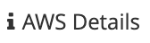
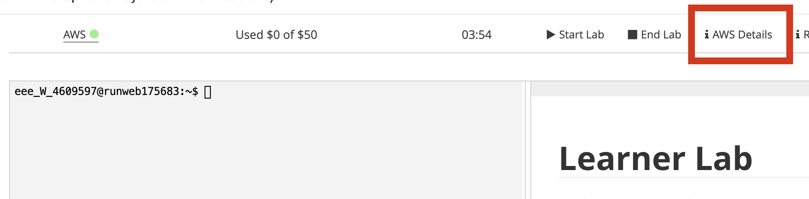
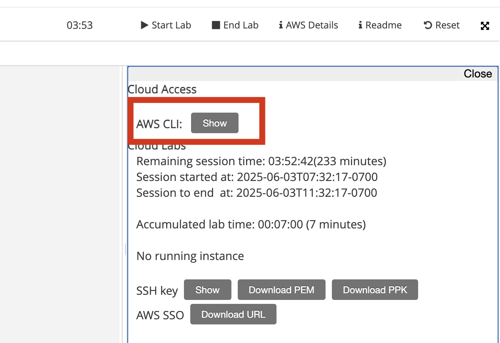
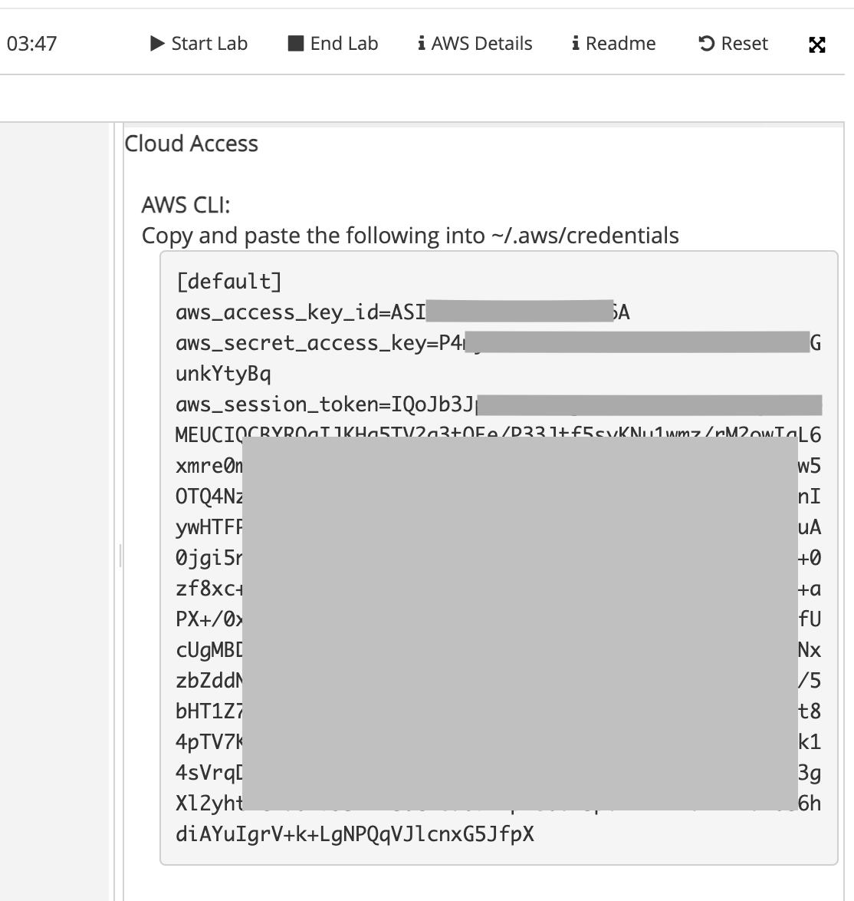

# Despliegue de la Aplicación Node.js + MySQL en la nube **AWS**
> Implementación completa, paso a paso, para llevar la app del ejercicio (API Node.js del repo Bezkoder + MySQL) a AWS usando servicios:  **ECR** + **ECS Fargate** + **ALB** + **RDS MySQL** + **Secrets Manager**.

---

## 1. Prerrequisitos

1). **Acceso AWS CLI** en la instancia EC2.

2) **Docker** en la instancia EC2 para construir la imagen a subir a **ECR**.
   
3) Repositorio de la API descargado y modificado para tomar variables de entorno.

## 1.1 Configuración de AWS CLI

### 1.1.1. Arrancar Laboratorio
   
   Esperar hasta que se complete el arranque del laboratorio. Cuando el laboratorio este arrancado, el icono AWS cambiará a verde: 
<br></br>

### 1.1.2. Obtener datos de configuración de AWS CLI

Hacer click en 
<br></br>

<br></br>
En el panel derecho aparecerá la información para configurar la **Interfáz de Línea de Comandos de AWS**, hacer click en **Show**



Finalmente el panel mostrará las claves de acceso y token para configurar AWS CLI. (El ejemplo las oculta por seguridad)



---

> **El procdemiento continúa en la Instancia EC2 (shell)**

---

### 1.1.3. Configuración de la AWS CLI

> **Las instancias Amazon Linux tienen instalado por defecto a Docker y la AWS CLI. Solo hace falta configurar las credenciales como se indica en esta sección.**
>  

---

### 1.1.3.1. Crear archivos de configuración de AWS CLI

1. Abrir sesión de consola en la instancia EC2
2. Crear el directorio `~/.aws`
3. Crear el archivo `~/.aws/config`
   
   Con el siguiente contenido:
```aws
[default]
region = us-east-1
```

4. Crear el archivo `~/.aws/credentials`
    
    Y copiar en su interior el contenido de la ventana de **AWS Details (AWS CLI)** obtenida en el punto 2.
  
  Por ejemplo:
```bash
[default]
aws_access_key_id=ASIAEXAMPLEKEY12345
aws_secret_access_key=wJalrXUtnFEMI/K7MDENG+bPxRfiCYEXAMPLEKEY
aws_session_token=IQoJb3JpZ2luX2V1EXAMPLETOKENaCXVzLXdlc3QtMiJHMEUCICDB4ZyVq...
oJgtHUWs9TX2vlpSqFyheiwm3ramZjCAJpTk14sVrqDjpniIZYJPRRD4mPHOPFRzrDKJwk7tO1y6...
+HiOLPxZTp2Ly3gXl2yhtTGVuUNb93YXh80CMea0bHzpEs0o15poEARvXTa4YIDaw086hdiAYuIg...
rV+k+LgNPQqVJlcnxG5JfpXEXAMPLETOKENCONTINUES==
```

---

### 1.1.3.2. Probar acceso a AWS

Para probar acceso a AWS ejecutar los siguientes comandos:

- Para verificar las credenciales:

```bash
aws sts get-caller-identity
```

Si está todo bien, la respuesta se verá similar a esta:

```json
{
    "UserId": "AROEXAMPLEUSERID12345:user4000004=_Student_View__Daniel_Buaon",
    "Account": "990000000001",
    "Arn": "arn:aws:sts::990000000001:assumed-role/voclabs/user4000004=_Student_View__Daniel_Buaon"
}
```

> **Configuración Completa** 

---

>**NOTA:**
Las credenciales de AWS del laboratorio son **temporales**. Expiran cuando la sesión de laboratorio expira a las **4 horas de arrancado**. 
Despues del tiempo de expiración, el laboratorio se detiene y los recursos de AWS quedan en suspenso y/o inactivos.

> **Cada vez que se arranca el laboratorio las credenciales temporales se renuevan, por lo que tienen que repetir el paso 1.1.3.1.4 actualizando el archivo `.aws/credentials`** 

>No es necesario actualizar `.aws/config`.

## 1.2 Docker
Verificar que la instancia EC2 tenga instalado Docker engine. Instalarlo si es necesario. 
> Puede seguir el procedmiento de la practica de Nube 1 para instalarlo.

## 1.3 Descargar el Repositorio de la API y modificarlo.

> El repositorio es el mismo del laboratorio 7.1-Docker-App Multicontenedor. No es necesario volver a descargar. Puede omitir el paso 1.3.1.

### 1.3.1 Descargar el repositorio y descomprimirlo

Desde el directorio home, ejecutar:

```bash
wget https://github.com/bezkoder/nodejs-express-mysql/archive/refs/heads/master.tar.gz

tar -xzf master.tar.gz
```

### 1.3.2 Modificar configuración para soportar variables de entorno

Editar el archivo `nodejs-express-mysql-master/app/config/db.config.js` y verificar que su contenido sea el siguiente:

```js
module.exports = {
  HOST: process.env.DB_HOST || "127.0.0.1",
  USER: process.env.DB_USER || "examuser",
  PASSWORD: process.env.DB_PASSWORD || "exampass",
  DB: process.env.DB_NAME || "examdb"
};
```
> Nota: el contenido de `db.config.js` es idéntico al del laboratorio 7.1-Docker-App Multicontenedor

## 2 Construir imagen Docker para la API Node.js

### 2.1 Crear el Dockerfile

Crear o editar el **Dockerfile** dentro de `nodejs-express-mysql-master` verificando que tenga el siguiente contenido:

```Dockerfile
FROM node:18
WORKDIR /app
COPY package*.json ./
RUN npm install
COPY . .
EXPOSE 8080
CMD ["node", "server.js"]
```
> Nota: el contenido del `Dockerfile` es idéntico al del laboratorio 7.1-Docker-App Multicontenedor
---

## 2.2 Construir y subir la imagen de la API a ECR

### 2.2.1. Crear repositorio ECR 
  
- **Alternativa 1** - Desde AWS CLI

 ```bash
 aws ecr create-repository --repository-name exam-api --region us-east-1
 ```

 - **Alternativa 2** - Desde Consola ECR
 
    - En consola AWS buscar el servicio **ECR (Elastic Container Registry)**

    - Click en **Create**

    - En **Repository Name** ingresar: **exam-api**

    - Click en **Create**

### 2.2.1. Conectar (login) Docker a ECR

#### - Obtener el ACCOUNT_ID

El ID de su cuenta de AWS (Account_Id) se puede obtener con el mismo comando AWS CLI del punto 1.1.3.2:

```bash
aws sts get-caller-identity
```

En la respuesta aparecerá indicado como **Account**
Por ej:
```
"Account": "990000000001"
```

**Tomar nota del AccountId**

#### - Login a ECR

   ```bash
   aws ecr get-login-password --region us-east-1 \
   | docker login --username AWS --password-stdin <TU_AWS_ACCOUNT_ID>.dkr.ecr.us-east-1.amazonaws.com
   ```

Por ejemplo: 
```bash
   aws ecr get-login-password --region us-east-1 \
   | docker login --username AWS --password-stdin 990000000001.dkr.ecr.us-east-1.amazonaws.com
   ```

> Si esta todo bien, verá **Login Succeeded** al final de la salida del comando.
>


### 2.3 Construir y subir la imagen (push)

```bash
cd nodejs-express-mysql-master
docker build -t exam-api:latest .
docker tag exam-api:latest <TU_AWS_ACCOUNT_ID>.dkr.ecr.us-east-1.amazonaws.com/exam-api:latest
docker push <TU_AWS_ACCOUNT_ID>.dkr.ecr.us-east-1.amazonaws.com/exam-api:latest
```

> Reemplazar `<TU_AWS_ACCOUNT_ID>` por el Account_Id obtenido en 2.2.1
>

Al terminar verificar la creación y subida de la imagen a ECR:
- En la consola AWS buscar el servicio ECR
- En el menú de la izquierda ir a **Private registry** - **Repositories** y seleccionar el repositorio **exam-api** y hacer click en el nombre.
- Deberá ver la lista de imagenes cargadas (latest)
  
---

---

## 3. Creación de una instancia MySQL 8.0 en RDS

- En la consola de AWS buscar el servicio **Aurora and RDS**

- En el menú de la izquierda seleccionar **Databases**
- Hacer click en **Create database**

- En **Choose a database creation method** seleccionar **Standard create**
- En **Engine options** seleccionar **MySQL**  
  > debe elegir la opción que dice solo "MySQL"
- En **Engine version** seleccionar MySQL 8.0.x (MySQL 8.0.42)
- En **Templates** seleccionar **Sandbox**
- En **Availability and durability** seleccionar **Single-AZ DB instance deployment** 
- En **DB instance identifier** ingresar: **database-1**
- En **Credentials Settings:
  - **Master username**: `examuser`
  - **Credentials management** seleccionar **Self managed**
  - **Master password**: `exampass`
  - **Confirm master password**: `exampass`
- Bajar hasta el final de la página y seleccionar **Additional configuration**
- En **Database options**
  - **Initial database name**: `examdb`

> **Dejar el resto de los campos en sus valores por defecto**

- Bajar al final de la página y hacer click en **Create database**
  
Si aparece un pop-up con complementos sugeridos hacer click en **Close**

> **Esperar hasta que el estado de la base de datos sea `Available`, esto puede demorar unos minutos.**

- Una vez creada la instancia de base de datos, copiar el **Endpoint** RDS (p.ej. `examdb.xxxxxx.us-east-1.rds.amazonaws.com`).


---

## 4 Secrets Manager: credenciales y config de DB

- En la consola de AWS buscar el servicio **AWS Secrets Manager**

- Hacer click en **Store a new secret**
  > Si aparece un mensaje de error **Failed to fetch a list of Amazon DocumentDB clusters.** ignorarlo.
- En **Chose secret type** seleccionar **Other type of secret**.
- En **Key/value pairs** seleccionar **Plaintext** y reemplazar el contenido de la ventana por el siguiente JSON:

```json
{
  "DB_HOST": "<endpoint RDS>",
  "DB_USER": "examuser",
  "DB_PASSWORD": "exampass",
  "DB_NAME": "examdb"
}
```
> Reemplazar <endpoint RDS> por el Endpoint guardado al crear la base de datos.

Por ejemplo:
```json
{
  "DB_HOST": "database-1.ce6j8j1l80yk.us-east-1.rds.amazonaws.com",
  "DB_USER": "examuser",
  "DB_PASSWORD": "exampass",
  "DB_NAME": "examdb"
}
```

- Hacer click en **Next**
- En **Configure Secret**
  - **Secret name**: `exam-api-db-secret`
- Hacer click en **Next**
  > Si aparece un mensaje de error **Failed to fetch a list of Amazon DocumentDB clusters.** ignorarlo.
- Hacer click en **Next**
- Revisar la configuración y hacer click en **Store**
